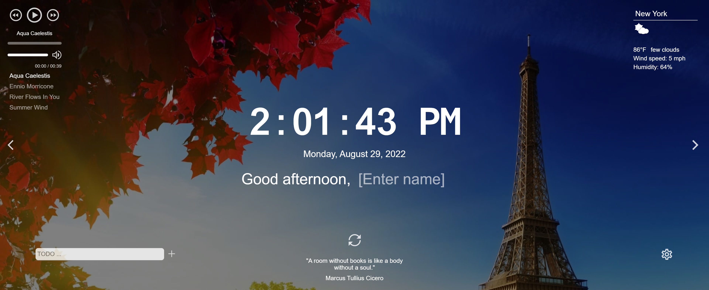

# momentum

## Description

The Momentum project is an analog [Momentum](https://chrome.google.com/webstore/detail/momentum/laookkfknpbbblfpciffpaejjkokdgca?hl=en) application from Google Chrome. The application shows the time and username. The background image and greeting changes depending on the time of day. It also has a clock, images slider, weather widget, audio player, quote of the day widget, and settings. The settings allow changing language and hiding some of the widgets.

## Screenshot

To see deploy click the [link](https://elena-myone.github.io/momentum/my-app/dist/)
